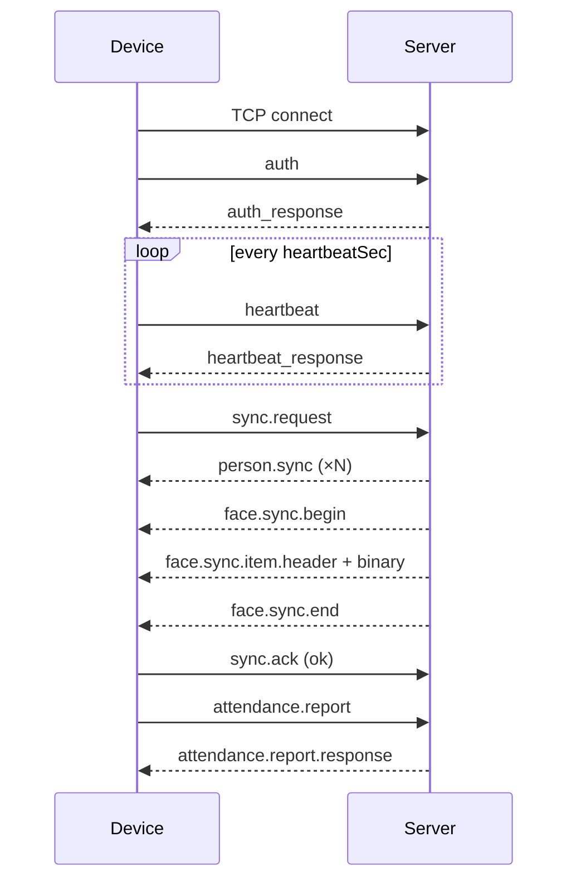
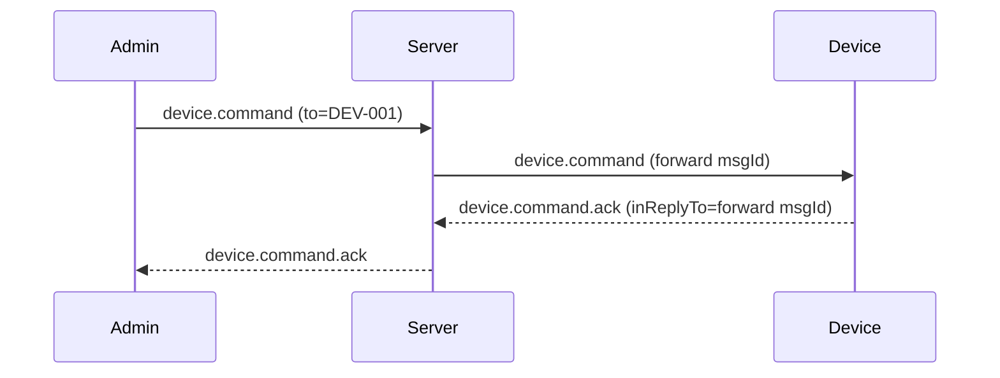

# 设备端开发指导文档

本文档基于当前代码库整理，供考勤**设备端**（门禁机、考勤终端、嵌入式人脸机等）对接服务端使用。

| 项目 | 路径 | 角色 |
|------|------|------|
| 服务端 | `D:\attendanceServer` | TCP 网关、MySQL、业务路由 |
| 管理端 | `E:\project\AttendanceServer` | Qt 桌面管理程序（**非**设备固件，但传输层可复用） |

**权威协议**：`docx/通信协议.md`、`protocol/ProtocolTypes.hpp`  
**管理端传输参考**：`E:\project\AttendanceServer\src\Network\TcpConnectionManager.cpp`

---

## 一、系统架构

### 1.1 三端拓扑

设备端与管理端均为 **TCP 客户端**，只连接服务端；**设备与管理端不直连**，跨端指令由服务端转发。

```
            ┌─────────────┐
   admin    │             │   device
  ────────▶ │   Server    │ ◀────────
            │  (TCP)      │
  ◀──────── │             │ ────────▶
            └─────────────┘
                  │
                  ▼
              MySQL (33060)
```

### 1.2 通信方式说明

| 方式 | 是否使用 |
|------|----------|
| TCP + JSON 行分帧 | **是**（唯一对外 API） |
| HTTP / REST | **否** |
| WebSocket | **否** |

设备开发只需实现 **TCP 客户端** 与下文消息类型，无需实现管理端的 CRUD 接口。

### 1.3 默认端口（注意环境差异）

| 组件 | 配置项 | 典型值 |
|------|--------|--------|
| 服务端 TCP | `tcp.port` / `--tcp` | **8080**（`attendance.json.example`） |
| 管理端连接默认 | `Presets.qml` | **9527**（开发时可在设置中修改） |
| MySQL X Protocol | `db.port` | 33060 |

联调前请向运维确认实际 `host:port`。服务端需启用 TCP：`tcp.enabled: true` 或启动参数 `attendanceServer --tcp 8080`。

---

## 二、传输层实现

### 2.1 文本帧（JSON 行）

- 编码：UTF-8  
- 每条消息为**一个 JSON 对象 + 换行符 `\n`**（紧凑序列化，JSON 内不得含裸换行）  
- 接收端维护缓冲区，按 `\n` 切分后解析  
- 单行上限：**1 MiB**（`net/Framing.hpp` → `kMaxJsonLineBytes`）

**发送示例（伪代码）：**

```text
line = JSON.stringify(envelope) + "\n"
socket.write(line)
```

### 2.2 二进制帧（长度前缀）

用于考勤照片、人脸特征向量等。

- 格式：`[4 字节大端 uint32 长度][payload 字节]`  
- 单帧 payload 上限：**16 MiB**（`kMaxBinaryPayloadBytes`）  
- **必须**紧跟在声明它的 JSON header 之后（如 `attendance.photo.header`、`face.sync.item.header`）  
- 收完二进制后回到文本行模式

**读取示例：**

```text
len = read_uint32_be()
payload = read_bytes(len)
```

### 2.3 与管理端客户端的差异

管理端 `TcpConnectionManager` 已实现上述逻辑，但：

1. 管理端 `role` 为 `admin`，认证用 `username` / `password`  
2. 管理端 `protocol.h` 中部分同步类型为**下划线**旧名（如 `person_sync`），**设备必须以服务端点分命名为准**（如 `person.sync`）  
3. 设备**不要**复制管理端的业务消息，仅可参考连接、分帧、心跳、`msgId` / `inReplyTo` 处理方式

---

## 三、统一消息信封

所有 JSON 消息共用外层结构：

```json
{
  "type": "attendance.report",
  "role": "device",
  "from": "DEV-001",
  "to": "server",
  "msgId": "550e8400-e29b-41d4-a716-446655440000",
  "inReplyTo": null,
  "ts": 1736400000000,
  "ack": false,
  "code": 0,
  "msg": "ok",
  "data": {}
}
```

| 字段 | 设备端填写说明 |
|------|----------------|
| `type` | 消息类型，见第四节 |
| `role` | 固定 `"device"` |
| `from` | 本机 `deviceId`，与认证一致 |
| `to` | 发往服务端时填 `"server"` 或省略 |
| `msgId` | 每条请求唯一 ID（UUID 等） |
| `inReplyTo` | 响应/回执时填**对方请求的 msgId** |
| `ts` | 毫秒时间戳（UTC 或本地一致即可） |
| `code` / `msg` | 一般由服务端在响应中填写；设备回执可带 `code: 0` |
| `data` | 业务字段 |

**字段命名**：服务端同时接受 **camelCase** 与 **snake_case**（如 `employeeId` / `employee_id`），建议新代码统一用 camelCase。

---

## 四、设备端消息清单

### 4.1 设备 → 服务端

| type | 说明 |
|------|------|
| `auth` | 连接后首条消息，认证 |
| `heartbeat` | 周期保活 |
| `attendance.report` | 考勤打卡上报 |
| `attendance.photo.header` | 打卡附带照片时，声明即将发送的二进制 JPEG |
| `device.status.report` | 上报设备名称、IP 等 |
| `sync.request` | 请求全量/增量人员与人脸下发 |
| `sync.ack` | 同步完成或失败回执 |
| `device.command.ack` | 管理端远程指令执行结果 |

### 4.2 服务端 → 设备

| type | 说明 |
|------|------|
| `auth_response` | 认证结果 |
| `heartbeat_response` | 心跳应答 |
| `attendance.report.response` | 打卡入库结果 |
| `device.status.report.response` | 状态上报应答 |
| `person.sync` | 人员批次下发（可能多条） |
| `face.sync.begin` | 人脸特征同步开始 |
| `face.sync.item.header` | 单条特征元数据，后接二进制 |
| `face.sync.end` | 人脸同步结束 |
| `device.command` | 远程指令（重启、重新同步等） |
| `error` | 通用错误 |

常量定义见：`D:\attendanceServer\protocol\ProtocolTypes.hpp`。

---

## 五、连接与认证

### 5.1 连接流程

```
1. TCP connect(host, port)
2. 发送 auth（role=device）—— 未认证前禁止其它消息
3. 收到 auth_response，code=0
4. 按 heartbeatSec 启动心跳定时器
5. 可选：device.status.report、sync.request
6. 业务循环：attendance.report、处理 device.command 等
7. 断线后重连，重复 2–6
```

### 5.2 认证请求

```json
{
  "type": "auth",
  "role": "device",
  "from": "DEV-001",
  "msgId": "req-auth-001",
  "ts": 1736400000000,
  "data": {
    "deviceId": "DEV-001",
    "deviceKey": "changeme",
    "fwVersion": "1.0.0"
  }
}
```

| 字段 | 说明 |
|------|------|
| `deviceId` | 设备唯一 ID，需与 `from` 一致 |
| `deviceKey` | 预共享密钥，**不在数据库中**，由服务端配置文件校验 |
| `fwVersion` | 固件版本（可选，便于运维） |

### 5.3 密钥配置（服务端）

`attendance.json` 示例：

```json
{
  "gateway": {
    "default_device_key": "changeme",
    "heartbeat_sec": 30,
    "heartbeat_grace_multiplier": 3,
    "duplicate_policy": "kick_old"
  }
}
```

可为每台设备单独配置：`gateway.device_keys` → `{ "DEV-001": "secret1" }`。

### 5.4 认证响应

```json
{
  "type": "auth_response",
  "role": "server",
  "from": "server",
  "to": "DEV-001",
  "inReplyTo": "req-auth-001",
  "code": 0,
  "msg": "ok",
  "data": {
    "sessionToken": "device-session-DEV-001",
    "serverTime": 1736400000000,
    "heartbeatSec": 30
  }
}
```

- 会话绑定在 **TCP 连接** 上，`sessionToken` 供日志/调试，设备无需在后续每条消息中携带 token。  
- 认证成功时服务端将 `Device` 表对应记录置为 `online` 并更新 `last_online`。

### 5.5 重复连接

`duplicate_policy`：

| 值 | 行为 |
|----|------|
| `kick_old`（默认） | 新连接踢掉同 deviceId 旧连接 |
| `reject_new` | 拒绝新连接，返回 `2003` |

### 5.6 心跳

间隔以 `auth_response.data.heartbeatSec` 为准（默认 30 秒）。超时阈值为 `heartbeat_sec × heartbeat_grace_multiplier`（默认 90 秒）无心跳则断连并标记离线。

```json
{
  "type": "heartbeat",
  "role": "device",
  "from": "DEV-001",
  "msgId": "hb-001",
  "ts": 1736400000000
}
```

---

## 六、考勤上报

### 6.1 基础上报

```json
{
  "type": "attendance.report",
  "role": "device",
  "from": "DEV-001",
  "msgId": "att-001",
  "ts": 1736400000000,
  "data": {
    "employeeId": "EMP-001",
    "checkTime": "2026-05-11 09:00:00",
    "status": "normal",
    "deviceId": "DEV-001",
    "awaitPhoto": false
  }
}
```

| 字段 | 必填 | 说明 |
|------|------|------|
| `employeeId` | 是 | 工号 |
| `checkTime` | 是 | 打卡时间，建议 `YYYY-MM-DD HH:MM:SS` |
| `status` | 是 | 考勤状态，如 `normal`、`late`（字符串，无服务端枚举限制） |
| `deviceId` | 否 | 若填写须与认证 deviceId 一致 |
| `awaitPhoto` | 否 | `true` 时服务端暂不入库，等待照片二进制 |

`status` 别名（任选其一）：`checkStatus`、`attendanceStatus`、`punchStatus`、`status`。

### 6.2 带照片流程

1. `attendance.report` 且 `awaitPhoto: true`  
2. 发送 `attendance.photo.header`  
3. 发送**一帧**二进制 JPEG  

**header：**

```json
{
  "type": "attendance.photo.header",
  "role": "device",
  "from": "DEV-001",
  "msgId": "photo-001",
  "ts": 1736400000000,
  "data": {
    "payloadLength": 102400,
    "contentType": "image/jpeg",
    "payloadEncoding": "raw"
  }
}
```

4. 写入 `payloadLength` 字节的 JPEG 二进制  
5. 收到 `attendance.report.response`

未在 `awaitPhoto` 流程内发送 photo header 会被拒绝；照片过大返回 `1002`。

### 6.3 服务端侧数据流

打卡写入表 `AttendanceRecord`（`employee_id`, `check_time`, `device_id`, `status`, `photo`, `received_time`）。管理端订阅 `attendance` 主题时可收到 `attendance.push` 实时通知（与设备无关）。

---

## 七、设备状态上报

```json
{
  "type": "device.status.report",
  "role": "device",
  "from": "DEV-001",
  "msgId": "status-001",
  "ts": 1736400000000,
  "data": {
    "deviceName": "前台考勤机",
    "ipAddress": "192.168.1.100"
  }
}
```

服务端更新 `Device.device_name`、`ip_address`、`last_online`。建议在认证成功后及 IP 变更时上报。

---

## 八、数据同步（人员 + 人脸）

### 8.1 触发同步

设备在**启动后**、**定时**或收到 `device.command`（如 `resync`）时发送：

```json
{
  "type": "sync.request",
  "role": "device",
  "from": "DEV-001",
  "msgId": "sync-001",
  "ts": 1736400000000,
  "data": {
    "deviceId": "DEV-001"
  }
}
```

约束（服务端实现）：

- 同一连接同时只能有一次同步（进行中再请求返回业务错误）  
- `sync.ack` 非 `ok` 累计 **3 次** 后暂时拒绝新的 `sync.request`  
- 人员分页约 **200** 条/页，人脸约 **100** 条/页（内部分页，对设备透明）

### 8.2 服务端下发顺序

```text
person.sync（可能多条，按行大小自动拆批）
  → face.sync.begin
  → [ face.sync.item.header + 二进制特征 ] × N
  → face.sync.end
```

设备应在**完整接收并落库**后发送 `sync.ack`。

### 8.3 person.sync

```json
{
  "type": "person.sync",
  "role": "server",
  "from": "server",
  "to": "DEV-001",
  "inReplyTo": "sync-001",
  "code": 0,
  "data": {
    "deviceId": "DEV-001",
    "persons": [
      {
        "id": 1,
        "name": "张三",
        "employeeId": "EMP-001",
        "department": "技术部",
        "position": "工程师"
      }
    ]
  }
}
```

多条 `person.sync` 时合并 `persons` 数组即可。

### 8.4 人脸特征

**face.sync.begin / face.sync.end**：标记阶段，无额外业务字段要求。

**face.sync.item.header**（每条特征一次）：

```json
{
  "type": "face.sync.item.header",
  "data": {
    "deviceId": "DEV-001",
    "employeeId": "EMP-001",
    "featureSize": 2048,
    "payloadLength": 2048,
    "contentType": "application/octet-stream",
    "payloadEncoding": "raw"
  }
}
```

紧跟读取 `payloadLength` 字节，即为该员工的特征向量（与服务端 ArcFace 提取格式一致，用于本地 1:N 比对）。

人脸注册在**管理端**完成（`face.register` + Base64 照片），详见 `docx/人脸特征提取开发指导.md`。设备只**消费**下发特征，不向服务端注册人脸。

### 8.5 同步确认

```json
{
  "type": "sync.ack",
  "role": "device",
  "from": "DEV-001",
  "msgId": "sync-ack-001",
  "inReplyTo": "sync-001",
  "ts": 1736400000000,
  "data": {
    "status": "ok",
    "message": ""
  }
}
```

| status | 含义 |
|--------|------|
| `"ok"` | 成功，重置失败计数 |
| 其它 | 失败，累计失败次数 |

---

## 九、远程指令（device.command）

### 9.1 透传路径

```
管理端 device.command → 服务端鉴权/查在线 → 设备 device.command → 设备 device.command.ack → 管理端
```

设备收到的消息示例（服务端会注入 `originAdmin`）：

```json
{
  "type": "device.command",
  "role": "server",
  "from": "server",
  "to": "DEV-001",
  "msgId": "admin-msg-id.fw.1",
  "data": {
    "command": "reboot",
    "params": {},
    "originAdmin": "admin_001"
  }
}
```

管理端 UI（`PageDevice.qml`）发送字段为 **`command`** + **`params`**（JSON 对象）。协议文档示例中的 `op` 与实现对齐时以 **`command`** 为准；设备可同时兼容 `op` 字段。

### 9.2 建议实现的 command

| command | 说明 |
|---------|------|
| `reboot` | 重启设备 |
| `resync` | 触发 `sync.request` |
| 自定义 | 解析 `params` 对象 |

### 9.3 回执

**必须**将 `inReplyTo` 设为服务端转发消息的 **`msgId`**（上例中的 `admin-msg-id.fw.1`），否则管理端会超时（`5002`，默认 10 秒）。

```json
{
  "type": "device.command.ack",
  "role": "device",
  "from": "DEV-001",
  "inReplyTo": "admin-msg-id.fw.1",
  "msgId": "ack-001",
  "ts": 1736400000000,
  "code": 0,
  "msg": "ok",
  "data": {
    "command": "reboot",
    "result": "success"
  }
}
```

---

## 十、错误码

| code | 含义 | 设备处理建议 |
|------|------|----------------|
| 0 | 成功 | — |
| 1001 | JSON 解析失败 | 检查序列化 |
| 1002 | 负载过大 | 压缩图片或减小特征 |
| 2001 | 未认证 | 先 auth |
| 2002 | 认证失败 | 检查 deviceId / deviceKey |
| 2003 | 重复会话 | 等待旧连接断开或换策略 |
| 3001 | 无权限 | 仅管理端 |
| 4000 | 业务校验失败 | 检查必填字段 |
| 4001 | 员工不存在 | 先 sync 人员 |
| 5001 | 设备离线 | 管理端下发指令时 |
| 5002 | 转发超时 | 及时回复 command.ack |
| 6001 | 重复键 | — |
| 6002 | 数据库错误 | 重试或告警 |

定义：`protocol/ProtocolTypes.hpp`。

---

## 十一、数据库与设备注册（联调须知）

### 11.1 Device 表

| 列 | 说明 |
|----|------|
| device_id | 与认证 ID 一致 |
| device_name | 可由 status.report 或管理端维护 |
| ip_address | 设备上报 |
| last_online | 心跳/上报时更新 |
| status | `online` / `offline` |

设备**首次认证成功**会 `upsert` 在线记录；管理端也可通过 `device.create` 预注册。

### 11.2 与管理端协作

| 管理端操作 | 设备侧影响 |
|------------|------------|
| `person.create/update/delete` | 下次 `sync.request` 生效 |
| `face.register/delete` | 下次同步更新本地特征库 |
| `device.command` | 即时收到 `device.command` |
| `device.query` | 仅管理端展示，设备无感 |

管理端默认连接 `127.0.0.1:9527`（`ui/models/Presets.qml`），与服务端 `8080` 不同时请统一配置。

---

## 十二、推荐模块划分（设备固件）

```
┌─────────────────────────────────────────┐
│  UI / 刷脸 / 打卡业务                    │
├─────────────────────────────────────────┤
│  AttendanceReporter  attendance.report   │
│  SyncManager         sync.* / person.*   │
│  CommandHandler    device.command        │
├─────────────────────────────────────────┤
│  ProtocolClient    信封、msgId、错误码    │
│  FrameCodec        JSON 行 + 二进制帧    │
│  HeartbeatTimer    heartbeat             │
├─────────────────────────────────────────┤
│  TcpTransport      connect / reconnect   │
└─────────────────────────────────────────┘
```

### 12.1 状态机建议

| 状态 | 允许操作 |
|------|----------|
| Disconnected | connect |
| Connected | auth |
| Authenticated | heartbeat、report、sync、command |
| AwaitingBinary | 仅读取指定长度二进制 |
| Syncing | 接收 person/face 流，完成后 sync.ack |

### 12.2 重连策略

可参考管理端：指数退避、最大重试次数、断线后**重新 auth**（会话不跨连接）。

### 12.3 本地存储

- 人员表：employeeId、name、department、position  
- 特征表：employeeId → feature blob（长度与 `featureSize` 一致）  
- 离线打卡队列：网络恢复后批量 `attendance.report`（注意时间与幂等）

---

## 十三、联调检查清单

- [ ] 服务端已启动 TCP：`attendanceServer --tcp 8080 --config attendance.json`  
- [ ] `gateway.default_device_key` 与设备配置一致  
- [ ] 设备 `deviceId` 与管理端「设备管理」中一致（或接受首次认证自动创建）  
- [ ] 管理端已添加人员并注册人脸（`face.register`）  
- [ ] 设备 auth → heartbeat → sync.request → 收到 person.sync / face.* → sync.ack  
- [ ] 设备 attendance.report → 管理端「考勤记录」可见  
- [ ] 管理端对在线设备发送 `reboot` 等指令 → 设备 command.ack 在 10s 内返回  

---

## 十四、时序图

### 14.1 上电同步与打卡



### 14.2 远程重启



---

## 十五、参考文件索引

### 服务端（D:\attendanceServer）

| 文件 | 内容 |
|------|------|
| `docx/通信协议.md` | 三端协议全文 |
| `docx/接口说明文档.md` | 接口表与示例（含设备专章） |
| `protocol/ProtocolTypes.hpp` | type 常量与错误码 |
| `protocol/GatewaySessionHandler.cpp` | 认证、心跳、消息分发 |
| `service/AttendanceService.cpp` | 打卡与照片 |
| `service/SyncService.cpp` | 人员/人脸同步 |
| `service/MessageRouter.cpp` | 指令转发 |
| `net/Framing.hpp` | 帧大小限制 |
| `attendance.json.example` | 配置模板 |
| `docx/人脸特征提取开发指导.md` | ArcFace 特征格式（管理端注册） |

### 管理端（E:\project\AttendanceServer）

| 文件 | 内容 |
|------|------|
| `src/Network/TcpConnectionManager.cpp` | TCP/JSON/二进制/心跳参考实现 |
| `src/Protocol/protocol.h` | 消息字段名（注意与服务器点分 type 差异） |
| `ui/pages/PageDevice.qml` | 设备 CRUD 与远程指令 UI |
| `src/Device/DeviceServer.cpp` | `device.command` 报文格式 |

---

## 十六、常见问题

**Q：设备连上立刻被断开？**  
A：检查是否在 auth 之前发送了其它消息；检查心跳是否启动。

**Q：sync.request 无响应或报错「sync already in progress」？**  
A：等待上一轮 person/face 流结束并发送 `sync.ack`；不要并发多次 sync。

**Q：打卡成功但管理端看不到？**  
A：确认管理端连的是同一服务端数据库；检查 `employeeId` 是否存在于 Person 表。

**Q：特征比对失败？**  
A：确认本地使用的算法与 ArcFace 特征维度一致；仅使用 `face.sync` 下发的二进制，勿自行改长度。

**Q：管理端发指令超时 5002？**  
A：`device.command.ack` 的 `inReplyTo` 必须填服务端转发包的 `msgId`，不是管理端原始 msgId。

---

*文档版本：与仓库 2026-05 代码同步。协议变更以 `docx/通信协议.md` 及 `ProtocolTypes.hpp` 为准。*
