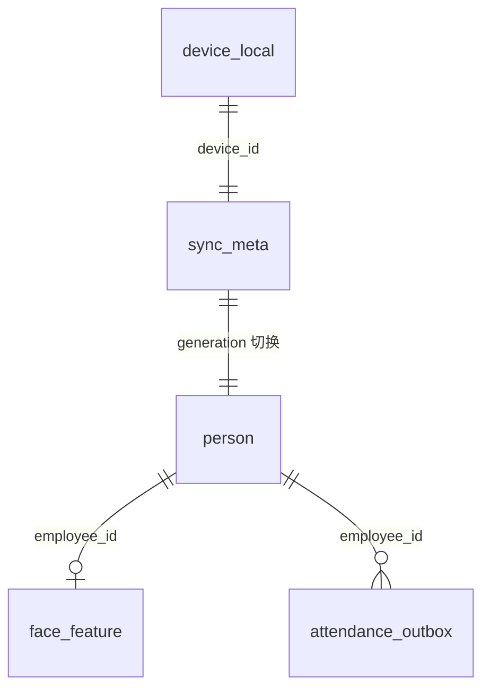

# 设备端数据库开发规范指导文档

> **适用范围**：考勤设备固件、嵌入式 SDK、设备端数据访问层（DAO/Repository）。  
> **规范来源**：服务端 `db/Schema.cpp`、`service/SyncService.cpp`、`db/PersonRepository.*`、`db/FaceDataRepository.*`、`db/AttendanceRecordRepository.*`。  
> **姊妹文档**：`docx/设备端开发指导文档.md`（工程联调）、`docx/设备端通信协议指导文档.md`（同步报文）、`docx/人脸特征提取开发指导.md`（ArcFace 特征格式）。

---

## 文档约定

| 符号 | 含义 |
|------|------|
| **M** | 必填 |
| **O** | 可选 |
| **服务端** | `D:\attendanceServer` MySQL 库（设备不直连，仅作字段对齐参考） |
| **设备端** | 设备本地嵌入式数据库（推荐 SQLite 3） |

设备端数据库**不替代**服务端 MySQL，仅缓存「人员 + 人脸特征」供离线识别，并持久化「待上报考勤」队列。账号、权限、RBAC、操作日志等**不得**写入设备库。

---

## 一、设计目标与原则

### 1.1 目标

| 目标 | 说明 |
|------|------|
| 离线识别 | 断网时仍能按 `employee_id` 做 1:N 人脸比对 |
| 离线打卡 | 断网时写入本地队列，恢复网络后上报 |
| 与服务端一致 | 字段语义、主键（工号）、特征字节与 `face.sync` 一致 |
| 可恢复 | 掉电、OTA、清库后可经 `sync.request` 全量重建 |
| 可维护 | 版本化 Schema、可观测的同步代次（generation） |

### 1.2 原则

1. **工号 `employee_id` 为业务主键**：人员、特征、离线打卡均以工号关联；服务端 `Person.id` 仅作同步参考，不作设备侧主键。  
2. **全量同步、代次切换**：当前服务端 `sync.request` 为**全量**分页下发（Person 200 条/页、Face 100 条/页），**无增量游标 API**。设备应采用「暂存区 → 校验 → 原子替换」而非逐条补丁长期累积。  
3. **特征只读**：设备**不**向本地库写入自提取特征用于上报；特征仅来自 `face.sync.item.header` + 二进制流，且须与 ArcFace 引擎版本一致。  
4. **敏感数据最小化**：`deviceKey`、会话 token、管理端密码**禁止**入库；可放安全存储或配置文件。  
5. **事务边界清晰**：单次 `sync.request` 对应一次「代次」提交；单条打卡上报与队列状态更新在同一事务内。

### 1.3 与服务端表的关系

```
┌─────────────────────────────────────────────────────────────┐
│  服务端 MySQL（attendanceServer）                            │
│  Person ──┬── face_data                                     │
│           └── AttendanceRecord（设备上报后写入）              │
│  Device（设备在线状态，设备端通常只缓存本机 device_id）       │
└───────────────────────────┬─────────────────────────────────┘
                            │ TCP sync.request / attendance.report
                            ▼
┌─────────────────────────────────────────────────────────────┐
│  设备端本地库（本文档规范）                                    │
│  person / face_feature / attendance_outbox / sync_meta …    │
└─────────────────────────────────────────────────────────────┘
```

---

## 二、技术选型

### 2.1 推荐方案

| 项目 | 推荐 | 说明 |
|------|------|------|
| 引擎 | **SQLite 3** | 嵌入式场景事实标准；单文件、WAL 模式支持并发读 |
| 访问层 | 原生 C API / ORM（如 SQLiteCpp） | 固件宜薄封装，避免过重 ORM |
| 编码 | UTF-8 | 与 JSON 协议一致 |
| 时间 | 文本 `YYYY-MM-DD HH:MM:SS` 或 INTEGER Unix 秒 | 与 `attendance.report` 的 `checkTime` 字符串对齐 |

### 2.2 连接与 PRAGMA 建议

```sql
PRAGMA journal_mode = WAL;
PRAGMA synchronous = NORMAL;      -- 掉电要求极高时可改为 FULL
PRAGMA foreign_keys = ON;
PRAGMA temp_store = MEMORY;
```

- 库文件路径建议固定，如 `/data/attendance/device.db`，启动时校验目录可写。  
- 单进程单写：识别线程只读，同步与队列由**单一线程**写库，避免锁竞争。

### 2.3 不推荐

| 方案 | 原因 |
|------|------|
| 设备直连 MySQL | 暴露数据库、网络与凭证风险；与架构不符 |
| 纯内存库 | 掉电丢失人员/特征/离线队列 |
| 无版本迁移 | OTA 后 Schema 不一致导致崩溃或脏数据 |

---

## 三、逻辑模型与表清单

### 3.1 表一览

| 表名 | 用途 | 对应服务端 |
|------|------|------------|
| `person` | 人员缓存 | `Person` |
| `face_feature` | 人脸特征 | `face_data` |
| `attendance_outbox` | 待上报打卡 | 上报后写入 `AttendanceRecord` |
| `sync_meta` | 同步代次与状态 | 无（设备私有） |
| `device_local` | 本机配置与运行态 | `Device` 子集 |

可选扩展（按产品需要）：

| 表名 | 用途 |
|------|------|
| `attendance_upload_log` | 已上报记录本地副本（审计、去重） |
| `kv_store` | 键值配置（固件版本、上次同步时间等） |

### 3.2 ER 关系（设备端）



---

## 四、表结构规范

以下 DDL 为**规范示例**（SQLite）。实现时表名、列名须与项目 DAO 一致；类型可按平台微调。

### 4.1 `person` — 人员

与 `person.sync` 的 `data.persons[]` 及服务端 `Person` 对齐。

| 列名 | 类型 | M | 说明 |
|------|------|---|------|
| `employee_id` | TEXT | M | 工号，**主键**；对应协议 `employeeId` |
| `server_person_id` | INTEGER | O | 服务端 `Person.id`，同步写入，便于排查 |
| `name` | TEXT | M | 姓名 |
| `department` | TEXT | O | 部门 |
| `position` | TEXT | O | 职位 |
| `updated_at` | TEXT | O | 本地最后更新时间（ISO 或 `YYYY-MM-DD HH:MM:SS`） |
| `sync_generation` | INTEGER | M | 所属同步代次，见 §6 |

```sql
CREATE TABLE IF NOT EXISTS person (
    employee_id         TEXT PRIMARY KEY NOT NULL,
    server_person_id    INTEGER,
    name                TEXT NOT NULL,
    department          TEXT,
    position            TEXT,
    updated_at          TEXT,
    sync_generation     INTEGER NOT NULL DEFAULT 0
);

CREATE INDEX IF NOT EXISTS idx_person_generation
    ON person(sync_generation);
```

**约束**：

- `employee_id` 非空、建议仅允许 `[A-Za-z0-9_-]`（与服务端 VARCHAR(100) 兼容）。  
- 同步入库前宜 `TRIM` 工号；空工号行**丢弃**并记日志。

### 4.2 `face_feature` — 人脸特征

与 `face.sync.item.header` + 二进制 payload 及服务端 `face_data` 对齐。

| 列名 | 类型 | M | 说明 |
|------|------|---|------|
| `employee_id` | TEXT | M | 主键，外键 → `person(employee_id)` |
| `feature_blob` | BLOB | M | 原始特征字节，长度 = `feature_size` |
| `feature_size` | INTEGER | M | 字节数，须等于 `LENGTH(feature_blob)` |
| `updated_at` | TEXT | O | 本地更新时间 |
| `sync_generation` | INTEGER | M | 同步代次 |

```sql
CREATE TABLE IF NOT EXISTS face_feature (
    employee_id     TEXT PRIMARY KEY NOT NULL,
    feature_blob    BLOB NOT NULL,
    feature_size    INTEGER NOT NULL,
    updated_at      TEXT,
    sync_generation INTEGER NOT NULL DEFAULT 0,
    FOREIGN KEY (employee_id) REFERENCES person(employee_id)
        ON DELETE CASCADE
);

CREATE INDEX IF NOT EXISTS idx_face_generation
    ON face_feature(sync_generation);
```

**约束**：

- 写入前校验：`feature_size > 0` 且 `feature_size == blob 长度`。  
- 服务端 `featureSize` / `payloadLength` 与二进制长度不一致时**跳过该条**并记日志（与服务端 `SyncService` 跳过坏行行为一致）。  
- 特征维度以管理端注册为准（ArcFace 常见约 **1032～2056 字节**，以实际 `featureSize` 为准，**禁止**硬编码旧版本长度）。

### 4.3 `attendance_outbox` — 离线打卡队列

设备上报前本地持久化；成功收到 `attendance.report.response` 后删除或归档。

| 列名 | 类型 | M | 说明 |
|------|------|---|------|
| `id` | INTEGER | M | 自增主键 |
| `client_msg_id` | TEXT | M | 对应 `attendance.report` 的 `msgId`，**唯一** |
| `employee_id` | TEXT | M | 工号 |
| `check_time` | TEXT | M | `YYYY-MM-DD HH:MM:SS` |
| `status` | TEXT | M | 如 `normal`、`late` |
| `photo_blob` | BLOB | O | 可选 JPEG；无照片则为 NULL |
| `photo_size` | INTEGER | O | 照片字节数 |
| `created_at` | TEXT | M | 入队时间 |
| `retry_count` | INTEGER | M | 重试次数，默认 0 |
| `last_error` | TEXT | O | 上次失败原因（code/msg） |
| `state` | TEXT | M | 见下表 |

**`state` 枚举**：

| 值 | 含义 |
|----|------|
| `pending` | 待发送 |
| `sending` | 已取出，等待 response（防重复发送） |
| `failed` | 可重试失败 |
| `dead` | 超过最大重试或业务不可恢复（如 4001） |

```sql
CREATE TABLE IF NOT EXISTS attendance_outbox (
    id              INTEGER PRIMARY KEY AUTOINCREMENT,
    client_msg_id   TEXT NOT NULL UNIQUE,
    employee_id     TEXT NOT NULL,
    check_time      TEXT NOT NULL,
    status          TEXT NOT NULL,
    photo_blob      BLOB,
    photo_size      INTEGER,
    created_at      TEXT NOT NULL,
    retry_count     INTEGER NOT NULL DEFAULT 0,
    last_error      TEXT,
    state           TEXT NOT NULL DEFAULT 'pending',
    FOREIGN KEY (employee_id) REFERENCES person(employee_id)
);

CREATE INDEX IF NOT EXISTS idx_outbox_state_created
    ON attendance_outbox(state, created_at);
```

**业务规则**：

- 入队前建议校验 `employee_id` 存在于 `person`（离线识别已通过）；否则仍可入队但上报可能得 `4001`。  
- 带照片：本地存 JPEG；发送时走 `awaitPhoto` + `attendance.photo.header` + 原始字节（**无** 4 字节长度前缀），见 `docx/设备端通信协议指导文档.md` §2.2。  
- `client_msg_id` 应用 UUID，**同一条记录重试时不得更换**，以便与服务端响应 `inReplyTo` 对应。

### 4.4 `sync_meta` — 同步状态

| 列名 | 类型 | M | 说明 |
|------|------|---|------|
| `id` | INTEGER | M | 固定为 `1` 单行表 |
| `current_generation` | INTEGER | M | 当前生效代次 |
| `staging_generation` | INTEGER | O | 正在写入的暂存代次 |
| `last_sync_request_msg_id` | TEXT | O | 最近一次 `sync.request` 的 msgId |
| `last_sync_ok_at` | TEXT | O | 上次 `sync.ack` 成功时间 |
| `last_sync_status` | TEXT | O | `ok` / 失败摘要 |
| `person_count` | INTEGER | O | 生效代次人员数 |
| `face_count` | INTEGER | O | 生效代次特征数 |

```sql
CREATE TABLE IF NOT EXISTS sync_meta (
    id                          INTEGER PRIMARY KEY CHECK (id = 1),
    current_generation          INTEGER NOT NULL DEFAULT 0,
    staging_generation          INTEGER,
    last_sync_request_msg_id    TEXT,
    last_sync_ok_at             TEXT,
    last_sync_status            TEXT,
    person_count                INTEGER NOT NULL DEFAULT 0,
    face_count                  INTEGER NOT NULL DEFAULT 0
);

INSERT OR IGNORE INTO sync_meta (id, current_generation) VALUES (1, 0);
```

### 4.5 `device_local` — 本机信息

| 列名 | 类型 | M | 说明 |
|------|------|---|------|
| `id` | INTEGER | M | 固定 `1` |
| `device_id` | TEXT | M | 与认证 `deviceId` 一致 |
| `device_name` | TEXT | O | 可由 `device.status.report` 更新 |
| `ip_address` | TEXT | O | 本机 IP |
| `fw_version` | TEXT | O | 固件版本 |

```sql
CREATE TABLE IF NOT EXISTS device_local (
    id           INTEGER PRIMARY KEY CHECK (id = 1),
    device_id    TEXT NOT NULL,
    device_name  TEXT,
    ip_address   TEXT,
    fw_version   TEXT
);
```

---

## 五、协议字段映射

### 5.1 `person.sync` → `person`

| 协议字段 (JSON) | 数据库列 |
|-----------------|----------|
| `employeeId` | `employee_id` |
| `id` | `server_person_id` |
| `name` | `name` |
| `department` | `department` |
| `position` | `position` |

多条 `person.sync`：**合并**所有 `persons` 后写入同一 `staging_generation`（勿按消息条数覆盖整表）。

### 5.2 `face.sync.item.header` + 二进制 → `face_feature`

| 协议字段 | 数据库列 |
|----------|----------|
| `employeeId` | `employee_id` |
| `featureSize` / `payloadLength` | `feature_size`（须与 blob 一致） |
| 二进制 payload（header 后 **4 字节 BE 长度 + L 字节**） | `feature_blob` |

### 5.3 打卡业务 → `attendance_outbox` / 上报

| 本地列 | `attendance.report` data |
|--------|--------------------------|
| `employee_id` | `employeeId` |
| `check_time` | `checkTime` |
| `status` | `status`（或 `checkStatus` 等别名，上报任选其一） |
| `photo_blob` | `awaitPhoto: true` 时走 photo 流程 |

服务端入库字段参考 `AttendanceRecord`：`employee_id`, `check_time`, `device_id`, `status`, `photo`, `received_time`。

### 5.4 命名约定

| 层级 | 约定 |
|------|------|
| 设备本地 SQL | **snake_case**（`employee_id`） |
| TCP JSON | 建议 **camelCase**（`employeeId`） |
| DAO 结构体 | 与团队 C++/Qt 风格一致，映射层做一次转换 |

---

## 六、同步写入流程（核心）

### 6.1 代次（generation）模型

因服务端为**全量**同步，设备端推荐：

1. `staging_generation = current_generation + 1`  
2. 所有 `person.sync` / `face.sync` 数据写入 `sync_generation = staging_generation`  
3. 收到 `face.sync.end` 且校验通过后，**单事务**内：  
   - 删除 `sync_generation != staging_generation` 的 `person` / `face_feature`  
   - 或将 staging 行 `sync_generation` 更新为 `current_generation` 并删除旧代次  
   - `current_generation = staging_generation`  
4. 发送 `sync.ack`（`status: "ok"`）  
5. 失败则**不**切换代次，保留旧数据继续服务；`sync.ack` 非 ok 累计 3 次后服务端会拒绝新 `sync.request`

### 6.2 时序（与协议一致）

```text
sync.request (msgId = S)
  ← person.sync × N     → UPSERT person @ staging
  ← face.sync.begin
  ← face.sync.item.header + [4+L] × M  → UPSERT face_feature @ staging
  ← face.sync.end
  → 校验 person_count / face_count / 外键
  → COMMIT 代次切换
  → sync.ack (inReplyTo = S, status = ok)
```

### 6.3 暂存区实现方式（二选一）

| 方式 | 做法 | 优点 |
|------|------|------|
| A. 代次列 | 同表 `sync_generation`，切换时删旧代次 | 单库简单 |
| B. 影子表 | `person_staging` / `face_feature_staging`，成功后 `DROP` + `ALTER RENAME` | 切换原子、回滚容易 |

**禁止**：在收到 `face.sync.end` 之前删除当前生效代次数据。

### 6.4 人员无人脸

- `employee_id` 在 `person` 存在但无 `face_feature`：允许（未注册人脸）；识别模块跳过或提示。  
- `face_feature` 存在但 `person` 不存在：违反外键，**不得提交**；应在同步阶段先写 person 再写 face。

### 6.5 同步失败与回滚

| 场景 | 处理 |
|------|------|
| 中途断线 | 丢弃 staging 代次数据或保留不完整 staging，**不**切换 `current_generation` |
| 单条特征长度错误 | 跳过该条，继续；若跳过过多应 `sync.ack` 失败 |
| JSON 行超限 | 服务端拆批；设备按条追加即可 |
| `sync already in progress` | 等待上一轮结束或本地取消 staging |

### 6.6 与管理端变更的关系

| 管理端操作 | 设备库生效时机 |
|------------|----------------|
| `person.create/update/delete` | 下次全量 `sync.request` |
| `face.register/delete` | 下次全量 `sync.request` |
| 无增量删除列表 | 依赖代次切换删除「本次未下发」的旧人员/特征 |

**重要**：全量同步完成后，应删除**不在本次 staging 集合内**的 `employee_id`（代次切换时一并清理），否则离职人员仍会留在设备库。

---

## 七、考勤队列与上报

### 7.1 入队

刷脸/打卡成功 → 写 `attendance_outbox`（`state=pending`）→ 若在线则异步发送。

### 7.2 出队发送

```text
SELECT ... WHERE state = 'pending' ORDER BY created_at LIMIT N
UPDATE state = 'sending' WHERE id = ?
发送 attendance.report (msgId = client_msg_id)
  若 awaitPhoto：photo.header + 原始 JPEG
收到 attendance.report.response (inReplyTo = client_msg_id, code = 0)
  → DELETE 或 INSERT attendance_upload_log + DELETE outbox
code != 0
  → UPDATE state, retry_count, last_error
```

### 7.3 重试策略建议

| code | 建议 |
|------|------|
| 0 | 删除 outbox 记录 |
| 4001（员工不存在） | `dead`，触发提示或等待下次 sync |
| 6002（数据库错误） | `failed`，指数退避重试 |
| 网络断开 | `pending`，连接恢复后重试 |
| 1002（负载过大） | 压缩照片或去掉照片后重试 |

最大重试次数、退避上限由产品定义；超过后标记 `dead` 并上报告警日志。

### 7.4 幂等

- 以 `client_msg_id` 为幂等键；服务端当前**未**做打卡去重，同一 `msgId` 重复上报可能产生重复记录。  
- 设备必须在收到 `code=0` 的 response 后才删除 outbox，避免「超时重发」重复入库。

### 7.5 时间字段

- `check_time` 使用设备本地时钟，格式与服务端一致：`YYYY-MM-DD HH:MM:SS`。  
- 建议 NTP 或 `device.command` 校时；时钟严重偏差会导致考勤统计异常。

---

## 八、查询与索引规范

### 8.1 常用查询

| 场景 | SQL 要点 |
|------|----------|
| 1:N 识别加载特征 | `SELECT employee_id, feature_blob, feature_size FROM face_feature WHERE sync_generation = ?` 或当前代次 |
| 按工号查人 | `SELECT * FROM person WHERE employee_id = ?` |
| 待发队列 | `WHERE state = 'pending' ORDER BY created_at` |
| 统计 | `sync_meta.person_count` / `face_count` 在代次切换时 `COUNT(*)` 更新 |

### 8.2 索引原则

- 主键、外键、`state + created_at`、`sync_generation` 必备。  
- 避免对大 BLOB 建索引；`feature_blob` 不做全文索引。

---

## 九、Schema 版本与迁移

### 9.1 版本表

```sql
CREATE TABLE IF NOT EXISTS schema_version (
    version     INTEGER PRIMARY KEY,
    applied_at  TEXT NOT NULL
);
```

### 9.2 迁移规则

1. 启动时读取 `schema_version`；若低于代码内置版本，顺序执行 `migration_N.sql`。  
2. 迁移在**单独事务**中执行，失败则拒绝启动并提示恢复。  
3. 禁止在生产库直接 `ALTER` 无备份；OTA 前备份 `device.db`。  
4. 破坏性变更（如特征格式变更）应 bump 大版本并触发**强制全量 sync**。

### 9.3 与固件 OTA

| 步骤 | 动作 |
|------|------|
| OTA 前 | 可选导出 outbox 或确保队列已清空 |
| OTA 后 | 跑迁移 → `sync.request` → 验证 `person_count` / `face_count` |

---

## 十、安全与合规

| 项 | 要求 |
|----|------|
| 凭证 | `deviceKey` 不得写入 SQLite |
| 照片 | `photo_blob` 含生物识别信息，限制文件权限（如 `chmod 600`） |
| 库文件 | 存放于应用私有目录；Android 使用应用沙箱 |
| 清库 | 恢复出厂须 `DELETE` 或删文件，含特征与 outbox |
| 备份 | 出厂调试备份需脱敏策略 |

---

## 十一、Repository 分层建议（C++ 示例）

与服务器 `db/*Repository` 对称，设备端建议：

```
DeviceDb/
├── DeviceDatabase.cpp      // 打开库、PRAGMA、迁移
├── PersonRepository.cpp      // person CRUD、按代次批量写入
├── FaceFeatureRepository.cpp // BLOB 读写、校验 feature_size
├── AttendanceOutboxRepository.cpp
├── SyncMetaRepository.cpp
└── migrations/
    ├── 001_initial.sql
    └── 002_xxx.sql
```

**接口约定**（与服务器类似）：

- 空字符串表示「不更新该字段」（update 场景）。  
- 违反约束抛 `std::invalid_argument`；SQLite 错误包装为统一 `DeviceDbError`。  
- 批量写入使用**预编译语句 + 事务**（每批 50～200 条）。

---

## 十二、测试与验收

### 12.1 单元测试

- [ ] `feature_size` 与 BLOB 长度不一致时拒绝写入  
- [ ] 代次切换后旧 `employee_id` 不可查  
- [ ] 外键：无 person 时不能插入 face  
- [ ] outbox：`client_msg_id` 唯一约束  
- [ ] 迁移：从 v1 升到 v2 后数据完整

### 12.2 联调测试

- [ ] 全量 sync 后 `person_count` 与管理端人员数一致（有脸人员 ≤ `face_count`）  
- [ ] 断网打卡 → 恢复网络 → outbox 清空且管理端可见记录  
- [ ] 带照片打卡：outbox 存 JPEG，上报后服务端 `AttendanceRecord.photo` 非空  
- [ ] 离职员工：管理端删除人员并 sync 后，设备库无该 `employee_id`  
- [ ] 连续 3 次 `sync.ack` 失败后，服务端拒绝 sync（设备应提示检查本地库）

### 12.3 性能参考

| 规模 | 参考 |
|------|------|
| 500 人 / 500 特征 | 全量写入 < 5s（嵌入式 ARM，WAL） |
| 5000 人 | 评估分页合并与事务批大小；必要时压缩 DB `VACUUM` 维护窗口 |

---

## 十三、与服务端 Schema 对照表

| 服务端表.列 | 设备表.列 | 备注 |
|-------------|-----------|------|
| `Person.employee_id` | `person.employee_id` | 设备主键 |
| `Person.id` | `person.server_person_id` | 可选 |
| `Person.name` … `position` | 同名语义 | |
| `face_data.employee_id` | `face_feature.employee_id` | |
| `face_data.feature_vector` | `face_feature.feature_blob` | |
| `face_data.feature_size` | `face_feature.feature_size` | |
| `AttendanceRecord.*` | `attendance_outbox.*` | 上报前本地；无 `received_time` |
| `Device.device_id` | `device_local.device_id` | 设备不缓存他人设备列表 |

服务端**不存在**于设备库的表：`UserAccount`、`Role`、`Permission`、`OperationLog`、`AttendanceRecordArchive` 等。

---

## 十四、常见问题

**Q：能否只同步变更人员？**  
A：当前服务端仅全量分页；设备须按 §6 代次全量替换。若未来服务端增加增量 API，再扩展 `sync_meta` 游标字段。

**Q：特征长度必须用 2048 吗？**  
A：否。以每条 `featureSize` 为准，须与 ArcFace SDK 及管理端注册版本一致。

**Q：person.sync 很多条，要先清空表吗？**  
A：不要中途清空生效代次；写入 staging 代次，收到 `face.sync.end` 后再切换。

**Q：离线打卡时人员尚未 sync？**  
A：可入队，但上报可能 4001；产品可禁止或允许「仅记录工号」模式。

**Q：SQLite 与识别线程并发？**  
A：WAL 下可多读单写；识别只读当前代次快照，同步提交代次时短暂阻塞识别（或使用代次号判断缓存失效）。

---

## 十五、参考文件索引

| 文件 | 内容 |
|------|------|
| `db/Schema.cpp` | 服务端 MySQL 建表 |
| `db/PersonRepository.hpp` | 人员分页同步 |
| `db/FaceDataRepository.hpp` | 特征存储约束 |
| `db/AttendanceRecordRepository.hpp` | 打卡入库字段 |
| `service/SyncService.cpp` | 同步分页与下发顺序 |
| `service/AttendanceService.cpp` | 打卡校验逻辑 |
| `docx/设备端开发指导文档.md` | §12.3 本地存储概要 |
| `docx/设备端通信协议指导文档.md` | 二进制帧、sync 流程 |
| `docx/人脸特征提取开发指导.md` | ArcFace 特征提取 |

---

## 修订记录

| 版本 | 日期 | 说明 |
|------|------|------|
| 1.0 | 2026-05-19 | 初版；对齐服务端全量 sync 与 Schema |

---

*本文档描述设备端本地库规范；服务端表结构变更时请同步更新 §十三对照表与迁移说明。*
