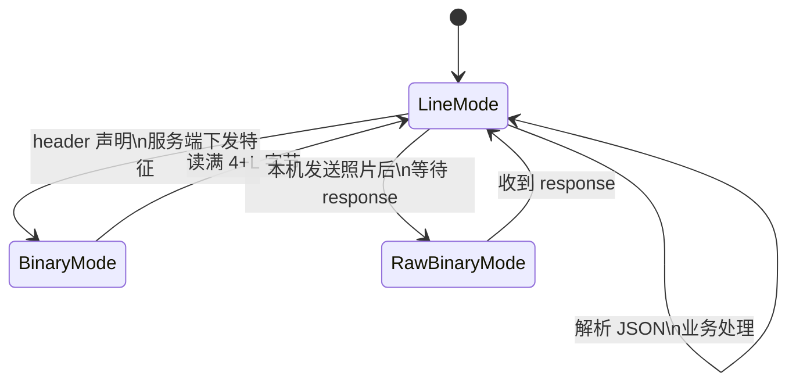

# 设备端通信协议指导文档（详细版）

> **适用范围**：考勤设备固件、SDK、协议测试工具。  
> **规范来源**：`docx/通信协议.md`、`protocol/ProtocolTypes.hpp`、`protocol/GatewaySessionHandler.cpp`、`net/Session.cpp`、`service/*Service.cpp`。  
> **姊妹文档**：`docx/设备端开发指导文档.md`（工程实现与联调）；本文档侧重**协议字节级语义、字段表、状态机与报文示例**。

---

## 文档约定

| 符号 | 含义 |
|------|------|
| **M** | 必填（Mandatory） |
| **O** | 可选（Optional） |
| **C** | 条件必填（Conditional） |
| `device` | 角色 `role` 固定为 `"device"` |
| `server` | 角色 `role` 为 `"server"` 的下行消息 |

JSON 序列化使用 **UTF-8 紧凑格式**（`dump()` 无缩进），键名区分大小写。  
消息类型 `type` 必须使用 **点分命名**（如 `attendance.report`），服务端**不做**下划线旧名自动映射。

---

## 1. 协议栈与连接

### 1.1 分层模型

```
┌─────────────────────────────────────┐
│  业务层：auth / report / sync / ack   │
├─────────────────────────────────────┤
│  信封层：type, role, from, msgId...   │
├─────────────────────────────────────┤
│  分帧层：JSON 行 / 二进制块           │
├─────────────────────────────────────┤
│  传输层：TCP (可选 TLS)               │
└─────────────────────────────────────┘
```

### 1.2 连接参数

| 参数 | 默认值 | 配置位置 |
|------|--------|----------|
| 传输协议 | TCP | — |
| 服务端监听 | `0.0.0.0:8080` | `attendance.json` → `tcp.port` |
| 启用 TCP | 默认关闭 | `tcp.enabled: true` 或 `--tcp [port]` |
| 单条 JSON 行上限 | 1 048 576 字节 | `net/Framing.hpp` |
| 二进制块上限 | 16 777 216 字节 | 同上 |
| 接收缓冲上限 | 1 MiB + 4 KiB | `kMaxRecvBufferBytes` |

设备为**客户端**，主动 `connect(host, port)`。同一 `deviceId` 默认策略 `kick_old`：新连接踢掉旧连接。

### 1.3 会话模型

- 认证前：连接 `role = unknown`，**仅允许** `type = auth`。  
- 认证后：会话绑定 `deviceId`，直至 TCP 断开。  
- **不**在每条业务消息中重复提交 `sessionToken`；token 仅出现在 `auth_response` 中供日志使用。  
- 断线或心跳超时：服务端 `markDeviceOffline`，设备需重新 `auth`。

---

## 2. 分帧规范（Framing）

### 2.1 文本帧：JSON 行

**格式**：`UTF-8(JSON_OBJECT) + LF`

| 规则 | 说明 |
|------|------|
| 分隔符 | 单字节 `\n`（0x0A） |
| CRLF | 服务端接收时剥除行尾 `\r` |
| 发送 | 服务端 `write_line` 会去掉已有换行再追加 `\n` |
| 解析 | 缓冲区内查找首个 `\n` 切行；无完整行则等待 |
| 超长 | 首个 `\n` 前超过 1 MiB → 丢弃该行并断连 |

**伪代码（接收）**：

```c
while (buffer_has_line()) {
    line = pop_until('\n');
    strip_trailing('\r');
    if (line.length > MAX_JSON_LINE) disconnect();
    obj = json_parse(line);
    dispatch(obj);
}
```

### 2.2 二进制块：方向不对称（重要）

协议中存在**两种二进制承载方式**，设备实现必须区分方向：

| 方向 | 触发 JSON | 二进制格式 | 说明 |
|------|-----------|------------|------|
| **服务端 → 设备** | `face.sync.item.header` 等 | `[uint32 BE 长度][payload]` | `Session::write_binary` 自动加 4 字节前缀 |
| **设备 → 服务端** | `attendance.photo.header` | **`payload` 原始字节×N** | `payloadLength=N`，**无** 4 字节前缀 |

#### 2.2.1 接收服务端人脸特征（带长度前缀）

```
face.sync.item.header  (JSON 行)
[0x00][0x00][0x08][0x00]  ← 大端 uint32 = 2048
<payload 2048 bytes>
```

解析步骤：

1. 解析 header JSON，读取 `data.payloadLength`（或 `featureSize`，二者在服务端下发时相等）。  
2. 从 TCP 流读取 **4 字节**大端整数 `L`。  
3. 再读取 **L 字节** payload（`L` 应等于 `payloadLength`）。  
4. 回到 JSON 行模式，等待下一条 `face.sync.item.header` 或 `face.sync.end`。

**大端解码**（与 `net/Framing.cpp` 一致）：

```c
uint32_t be32_to_uint(const uint8_t in[4]) {
    return ((uint32_t)in[0] << 24) | ((uint32_t)in[1] << 16)
         | ((uint32_t)in[2] << 8)  |  (uint32_t)in[3];
}
```

#### 2.2.2 上报考勤照片（无长度前缀）

```
attendance.report (awaitPhoto=true)   ← 无 response，进入挂起
attendance.photo.header               (JSON 行)
<JPEG raw bytes × payloadLength>      ← 直接写入 N 字节，无前缀
attendance.report.response            (JSON 行)
```

设备发送照片时：**不要**在 JPEG 前加 4 字节长度；长度仅由 header 的 `payloadLength` 声明，服务端按该长度从流中切分。

### 2.3 帧交织与状态机

单条 TCP 连接上，JSON 行与二进制块交替出现。设备接收状态机建议：



**禁止**在 `BinaryMode` / `RawBinaryMode` 未完成时向同一连接写入其它 JSON（除心跳外，见 §6.4）。

---

## 3. 统一消息信封

### 3.1 完整字段表

| 字段 | 类型 | M/O | 设备发送 | 设备接收 | 说明 |
|------|------|-----|----------|----------|------|
| `type` | string | M | ✓ | ✓ | 消息类型 |
| `role` | string | M | `device` | `server` | 发送方角色 |
| `from` | string | M | `deviceId` | `server` | 发送方标识 |
| `to` | string | O | `server` | `deviceId` | 目标标识 |
| `msgId` | string | M | ✓ | ✓ | 本条消息唯一 ID |
| `inReplyTo` | string | O | 回执时 M | 响应时 M | 关联请求 `msgId` |
| `ts` | int64 | M | ✓ | ✓ | 毫秒时间戳 |
| `ack` | bool | O | — | — | 是否要求对端应答（少用） |
| `code` | int | O | 回执可填 | 响应必有 | `0` = 成功 |
| `msg` | string | O | 回执可填 | 响应常有 | 人类可读描述 |
| `data` | object | O | 业务 | 业务 | 载荷；缺省 `{}` |

### 3.2 兼容顶层字段（迁移期）

解析时，若 `data` 内缺少下列键，服务端会把**信封顶层**同名键合并进 `data`（`protocol/Envelope.cpp`）：

- `deviceId`
- `status`
- `message`

建议新实现**只使用 `data` 内字段**，顶层不再冗余。

### 3.3 关联规则（msgId / inReplyTo）

| 模式 | 请求方 | 响应方 | 规则 |
|------|--------|--------|------|
| 请求-响应 | 设备 `msgId = A` | 服务端 `inReplyTo = A` | 打卡、状态上报、认证、心跳 |
| 同步流 | 设备 `msgId = S` | 多条下行 `inReplyTo = S` | `person.sync`、`face.sync.*` |
| 指令回执 | 服务端转发 `msgId = F` | 设备 `inReplyTo = F` | **不是**管理端原始 ID |
| 推送 | 服务端生成新 `msgId` | 无 `inReplyTo` | 设备一般不收推送 |

TCP 上消息**可能乱序插入**（如心跳、同步流中间插入），不可用“上一条消息类型”推断响应，必须依赖 `inReplyTo`。

---

## 4. 设备端消息类型总表

### 4.1 设备 → 服务端

| type | 认证后 | 响应 type | 二进制 |
|------|--------|-----------|--------|
| `auth` | 否（首条） | `auth_response` | 无 |
| `heartbeat` | 是 | `heartbeat_response` | 无 |
| `attendance.report` | 是 | `attendance.report.response` | 可选见 §7 |
| `attendance.photo.header` | 是 | 无（随后触发 report 完成） | 设备发原始 JPEG |
| `device.status.report` | 是 | `device.status.report.response` | 无 |
| `sync.request` | 是 | 无即时响应；下行流 | 无 |
| `sync.ack` | 是 | **无**（服务端仅记日志） | 无 |
| `device.command.ack` | 是 | 无（服务端转发给管理端） | 无 |

### 4.2 服务端 → 设备

| type | 触发条件 | inReplyTo | 二进制 |
|------|----------|-----------|--------|
| `auth_response` | auth 成功/失败 | 请求的 msgId | 无 |
| `heartbeat_response` | heartbeat | 请求的 msgId | 无 |
| `error` | 任意错误 | 请求的 msgId | 无 |
| `attendance.report.response` | 打卡入库完成 | 报告的 msgId | 无 |
| `device.status.report.response` | 状态更新完成 | 请求的 msgId | 无 |
| `person.sync` | sync.request | sync.request 的 msgId | 无 |
| `face.sync.begin` | 人员流结束 | sync.request 的 msgId | 无 |
| `face.sync.item.header` | 人脸分页 | sync.request 的 msgId | **4+L** |
| `face.sync.end` | 人脸流结束 | sync.request 的 msgId | 无 |
| `device.command` | 管理端下发 | 新分配转发 msgId | 无 |

---

## 5. 认证与心跳

### 5.1 auth（设备 → 服务端）

**type**：`auth`  
**role**：`device`  
**from**：与 `data.deviceId` 一致  

**data 字段**：

| 字段 | 类型 | M/O | 说明 |
|------|------|-----|------|
| `deviceId` | string | M | 设备唯一 ID，建议 `[A-Z0-9_-]+` |
| `deviceKey` | string | M | 预共享密钥 |
| `fwVersion` | string | O | 固件版本 |

**请求示例**：

```json
{"type":"auth","role":"device","from":"DEV-001","to":"server","msgId":"a1","ts":1736400000000,"data":{"deviceId":"DEV-001","deviceKey":"changeme","fwVersion":"2.0.1"}}
```

**服务端行为**：

1. 校验 `deviceKey`（`gateway.device_keys[deviceId]` 或 `default_device_key`）。  
2. `upsertDeviceOnline`，写 `status=online`、`last_online`。  
3. 注册 `DeviceRegistry`；`duplicate_policy=reject_new` 时若已在线返回 `2003`。  
4. 绑定连接 `ctx.device_id`，启动心跳定时器。

### 5.2 auth_response（服务端 → 设备）

**成功 data 字段**：

| 字段 | 类型 | 说明 |
|------|------|------|
| `sessionToken` | string | 形如 `device-session-{deviceId}` |
| `serverTime` | int64 | 服务端毫秒时间戳 |
| `heartbeatSec` | int | 建议心跳间隔（秒），默认 30 |
| `roles` | array | 设备端通常为空数组 |
| `permissions` | array | 设备端通常为空数组 |

**成功示例**：

```json
{"type":"auth_response","role":"server","from":"server","to":"DEV-001","inReplyTo":"a1","ts":1736400001000,"code":0,"msg":"ok","data":{"sessionToken":"device-session-DEV-001","serverTime":1736400001000,"heartbeatSec":30,"roles":[],"permissions":[]}}
```

**失败**：`type` 可能为 `error` 或 `auth_response` 且 `code != 0`。

| code | msg 示例 | 处理 |
|------|----------|------|
| 2002 | `invalid device key` | 检查密钥配置 |
| 2003 | `device already connected` | 等待旧连接释放或换策略 |

### 5.3 heartbeat

**周期**：建议 `heartbeatSec`（默认 30s），可略小于服务端超时窗口的 1/3。  
**超时断开**：`heartbeat_sec × heartbeat_grace_multiplier`（默认 30×3=90s）无心跳则断连。

**请求**（无 data）：

```json
{"type":"heartbeat","role":"device","from":"DEV-001","msgId":"hb-1","ts":1736400030000}
```

**响应**：

```json
{"type":"heartbeat_response","role":"server","from":"server","to":"DEV-001","inReplyTo":"hb-1","ts":1736400030050,"code":0,"msg":"ok"}
```

每次收到任意合法消息，服务端会重置心跳截止时间（不仅限于 heartbeat）。

### 5.4 未认证拦截

认证前发送非 `auth` 消息 → `error`，`code = 2001`，`msg = "not authenticated"`。

---

## 6. 考勤上报

### 6.1 attendance.report

**data 字段**：

| 字段 | 类型 | M/O | 别名（服务端接受） |
|------|------|-----|-------------------|
| `employeeId` | string | M | `employee_id` |
| `checkTime` | string | M | `check_time` |
| `status` | string | M | `checkStatus`, `attendanceStatus`, `punchStatus` |
| `deviceId` | string | O | `device_id`；若填须等于会话 deviceId |
| `awaitPhoto` | bool | O | 默认 `false` |

**status 建议值**（无强制枚举，与管理端展示一致即可）：

| 值 | 含义 |
|----|------|
| `normal` | 正常 |
| `late` | 迟到 |
| `early` | 早退 |
| `absent` | 缺勤 |

**checkTime 格式**：`YYYY-MM-DD HH:MM:SS`（服务端按字符串写入 MySQL `TIMESTAMP`）。

#### 6.1.1 awaitPhoto = false（立即入库）

**时序**：

```
Device ── attendance.report ──────────────► Server
Device ◄── attendance.report.response ─── Server
```

**请求**：

```json
{"type":"attendance.report","role":"device","from":"DEV-001","msgId":"rpt-1","ts":1736400100000,"data":{"employeeId":"EMP-001","checkTime":"2026-05-19 09:00:00","status":"normal","awaitPhoto":false}}
```

**成功响应**：

```json
{"type":"attendance.report.response","role":"server","from":"server","to":"DEV-001","inReplyTo":"rpt-1","ts":1736400100050,"code":0,"msg":"ok","data":{}}
```

#### 6.1.2 awaitPhoto = true（带照片）

**时序**（注意：**先照片，后 response**）：

```
Device ── attendance.report (awaitPhoto=true) ──► Server  [挂起，无响应]
Device ── attendance.photo.header ─────────────► Server
Device ── <JPEG × payloadLength> ───────────────► Server  [原始字节]
Device ◄── attendance.report.response ────────── Server
```

**步骤 1 — report**：

```json
{"type":"attendance.report","role":"device","from":"DEV-001","msgId":"rpt-2","ts":1736400200000,"data":{"employeeId":"EMP-001","checkTime":"2026-05-19 09:01:00","status":"normal","awaitPhoto":true}}
```

**步骤 2 — photo header**：

| 字段 | 类型 | M | 说明 |
|------|------|---|------|
| `payloadLength` | uint | M | JPEG 字节数 |
| `contentType` | string | O | 建议 `image/jpeg` |
| `payloadEncoding` | string | O | 建议 `raw` |

```json
{"type":"attendance.photo.header","role":"device","from":"DEV-001","msgId":"ph-1","ts":1736400200100,"data":{"payloadLength":98304,"contentType":"image/jpeg","payloadEncoding":"raw"}}
```

**步骤 3**：发送 **98304 字节** JPEG（无 4 字节前缀）。

**步骤 4**：收到 `attendance.report.response`，`inReplyTo` = **步骤 1 的 msgId**（`rpt-2`）。

#### 6.1.3 挂起态约束

存在 `pending_attendance` 时，若设备发送除以下类型外的消息，服务端会取消挂起并返回错误：

- 允许：`heartbeat`、`attendance.photo.header`  
- 其它：返回 `4000`，`pending attendance photo aborted`

### 6.2 业务错误示例

| code | msg | 原因 |
|------|-----|------|
| 4000 | `missing employee_id, check_time, or attendance status` | 缺字段 |
| 4000 | `deviceId mismatch` | data.deviceId 与会话不一致 |
| 4000 | `no pending attendance for photo` | 未先 report 或 awaitPhoto=false |
| 1002 | `invalid payloadLength` | 长度非法或超限 |
| 6002 | 数据库异常 | 重试或告警 |

---

## 7. 设备状态上报

### 7.1 device.status.report

| 字段 | 类型 | M/O | 别名 |
|------|------|-----|------|
| `deviceName` | string | O | `device_name` |
| `ipAddress` | string | O | `ip_address` |

**说明**：更新 `Device` 表名称与 IP，并刷新 `last_online`；**不**通过本接口修改 `status` 枚举（在线/离线由连接生命周期维护）。

**请求**：

```json
{"type":"device.status.report","role":"device","from":"DEV-001","msgId":"st-1","ts":1736400300000,"data":{"deviceName":"一楼大厅考勤机","ipAddress":"192.168.1.50"}}
```

**响应**：

```json
{"type":"device.status.report.response","role":"server","from":"server","to":"DEV-001","inReplyTo":"st-1","ts":1736400300050,"code":0,"msg":"ok","data":{}}
```

---

## 8. 数据同步协议

### 8.1 概述

设备通过 `sync.request` 拉取**全量**人员与人脸特征（分页在服务端完成，对设备表现为连续多帧）。

**分页参数（服务端内部，设备无感）**：

| 数据 | 每页条数 |
|------|----------|
| Person | 200 |
| FaceData | 100 |

**并发限制**：

- 同一连接 `sync` 进行中再次 `sync.request` → `4000` `sync already in progress`  
- 连续 3 次 `sync.ack` 的 `status != "ok"` → 暂时拒绝同步

### 8.2 sync.request

| 字段 | 类型 | M/O | 说明 |
|------|------|-----|------|
| `deviceId` | string | O | 若填须等于会话 deviceId |

```json
{"type":"sync.request","role":"device","from":"DEV-001","msgId":"sync-1","ts":1736400400000,"data":{"deviceId":"DEV-001"}}
```

**无**立即的 `sync.request.response`；所有下行均 `inReplyTo = "sync-1"`。

### 8.3 下行消息顺序

```text
person.sync          × M 批
face.sync.begin      × 1
face.sync.item.header + [4字节长度][特征]  × N
face.sync.end        × 1
```

若人员表为空：跳过 `person.sync` 批次，直接 `face.sync.begin`。

### 8.4 person.sync

**信封额外字段**（兼容）：顶层或 `data` 内可有 `deviceId`。

**data.persons[] 元素**：

| 字段 | 类型 | 说明 |
|------|------|------|
| `id` | int | 数据库主键 |
| `name` | string | 姓名 |
| `employeeId` | string | 工号（设备主键） |
| `department` | string | 部门 |
| `position` | string | 职位 |

**示例**：

```json
{"type":"person.sync","role":"server","from":"server","to":"DEV-001","inReplyTo":"sync-1","ts":1736400401000,"code":0,"msg":"ok","deviceId":"DEV-001","data":{"deviceId":"DEV-001","persons":[{"id":1,"name":"张三","employeeId":"EMP-001","department":"研发部","position":"工程师"}]}}
```

**实现要点**：

- 多条 `person.sync` 应**合并** `persons` 数组到本地库。  
- 单条 JSON 行接近 1 MiB 时服务端自动拆批；设备按条追加即可。

### 8.5 face.sync 阶段

#### face.sync.begin

```json
{"type":"face.sync.begin","role":"server","from":"server","to":"DEV-001","inReplyTo":"sync-1","ts":1736400402000,"code":0,"msg":"ok","data":{"deviceId":"DEV-001"}}
```

#### face.sync.item.header + 二进制

**data 字段**：

| 字段 | 类型 | 说明 |
|------|------|------|
| `employeeId` | string | 对应人员工号 |
| `featureSize` | int | 特征维度字节数（与 payload 等长） |
| `payloadLength` | int | 同 featureSize |
| `contentType` | string | `application/octet-stream` |
| `payloadEncoding` | string | `raw` |

```json
{"type":"face.sync.item.header","role":"server","from":"server","to":"DEV-001","inReplyTo":"sync-1","ts":1736400403000,"code":0,"msg":"ok","data":{"deviceId":"DEV-001","employeeId":"EMP-001","featureSize":2056,"payloadLength":2056,"contentType":"application/octet-stream","payloadEncoding":"raw"}}
```

随后 TCP 流：

```hex
00 00 08 08    ← BE uint32 = 2056
<payload 2056 bytes>
```

**校验**：

- 读取的 `L` 应等于 `payloadLength`。  
- `featureSize` 应与本地引擎要求一致（ArcFace 常见 2KB 级，以管理端注册为准）。  
- `employeeId` 无对应人员时可跳过并记日志。

#### face.sync.end

```json
{"type":"face.sync.end","role":"server","from":"server","to":"DEV-001","inReplyTo":"sync-1","ts":1736400500000,"code":0,"msg":"ok","data":{"deviceId":"DEV-001"}}
```

收到 `face.sync.end` 表示服务端推送结束，设备可持久化并发送 `sync.ack`。

### 8.6 sync.ack

| 字段 | 类型 | M | 说明 |
|------|------|---|------|
| `status` | string | M | `"ok"` 表示成功 |
| `message` | string | O | 失败原因 |

```json
{"type":"sync.ack","role":"device","from":"DEV-001","msgId":"ack-1","inReplyTo":"sync-1","ts":1736400501000,"data":{"status":"ok","message":""}}
```

**服务端行为**：仅写日志与失败计数；**不回复** JSON。  
`status != "ok"` 累计 3 次后拒绝新的 `sync.request`。

---

## 9. 远程指令（device.command）

### 9.1 透传路径

```
Admin  msgId=A  ──device.command──►  Server
Server msgId=F  ──device.command──►  Device   (F = A + ".fw." + seq)
Device inReplyTo=F ──device.command.ack──► Server ──► Admin inReplyTo=A
```

**超时**：转发后 **10 秒**内未收到设备 ack → 管理端 `5002 FORWARD_TIMEOUT`。

### 9.2 device.command（服务端 → 设备）

**data 字段**（由管理端传入，服务端追加 `originAdmin`）：

| 字段 | 类型 | 说明 |
|------|------|------|
| `command` | string | 指令名（管理端 UI 必填） |
| `params` | object | 参数 JSON 对象，可为 `{}` |
| `originAdmin` | string | 发起操作员 ID（服务端注入） |
| `op` | string | 协议文档示例字段；**管理端实际发送 `command`**，设备宜同时兼容 |

**示例**：

```json
{"type":"device.command","role":"server","from":"server","to":"DEV-001","msgId":"cmd-020.fw.1","ts":1736400600000,"data":{"command":"reboot","params":{},"originAdmin":"admin_001"}}
```

### 9.3 device.command.ack（设备 → 服务端）

| 字段 | 类型 | M/O | 说明 |
|------|------|-----|------|
| `inReplyTo` | string | **M** | 必须为转发包 `msgId`（上例 `cmd-020.fw.1`） |
| `code` | int | O | `0` 成功 |
| `msg` | string | O | 描述 |
| `data` | object | O | 自定义执行结果 |

```json
{"type":"device.command.ack","role":"device","from":"DEV-001","inReplyTo":"cmd-020.fw.1","msgId":"ack-cmd-1","ts":1736400605000,"code":0,"msg":"ok","data":{"command":"reboot","result":"success"}}
```

**注意**：`device.command.ack` 不会以 `device.command.ack.response` 形式再回复设备；服务端直接转发给管理端。

### 9.4 建议指令集

| command | params 示例 | 设备行为 |
|---------|-------------|----------|
| `reboot` | `{}` | 安全重启 |
| `resync` | `{}` | 触发 `sync.request` |
| `set_time` | `{"serverTime":1736400000000}` | 校时（若实现） |
| 自定义 | 任意 JSON | 厂商扩展 |

---

## 10. 错误消息（error）

**type**：`error`  
**字段**：`code`、`msg`、`inReplyTo`、`to`

```json
{"type":"error","role":"server","from":"server","to":"DEV-001","inReplyTo":"rpt-x","ts":1736400700000,"code":4000,"msg":"missing employee_id, check_time, or attendance status"}
```

### 10.1 错误码全集（设备相关）

| code | 常量 | 场景 |
|------|------|------|
| 0 | — | 成功 |
| 1001 | kCodeParseError | JSON 无法解析 |
| 1002 | kCodePayloadTooLarge | 行或二进制超限 |
| 2001 | kCodeNotAuthenticated | 未 auth |
| 2002 | kCodeAuthFailed | 密钥错误、缺字段 |
| 2003 | kCodeDuplicateSession | 重复连接被拒绝 |
| 3001 | kCodeForbidden | 角色不符（设备不应收到） |
| 4000 | kCodeBusinessValidation | 业务校验 |
| 4001 | kCodeEmployeeNotFound | 员工不存在 |
| 5001 | kCodeDeviceOffline | 仅管理端指令 |
| 5002 | kCodeForwardTimeout | 仅管理端指令 |
| 6001 | kCodeDuplicateKey | 数据库唯一冲突 |
| 6002 | kCodeDbError | 数据库执行失败 |

---

## 11. 完整交互示例

### 11.1 上电：认证 → 同步 → 打卡

```text
→ {"type":"auth",...,"data":{"deviceId":"DEV-001","deviceKey":"changeme","fwVersion":"1.0"}}
← {"type":"auth_response",...,"code":0,"data":{"heartbeatSec":30,...}}

→ {"type":"device.status.report",...,"data":{"deviceName":"Gate-1","ipAddress":"10.0.0.8"}}
← {"type":"device.status.report.response",...,"code":0}

→ {"type":"sync.request",...,"msgId":"sync-1",...}
← {"type":"person.sync",...,"inReplyTo":"sync-1",...}
← {"type":"face.sync.begin",...,"inReplyTo":"sync-1"}
← {"type":"face.sync.item.header",...,"inReplyTo":"sync-1",...}
← [4 bytes BE][feature bytes]
← {"type":"face.sync.end",...,"inReplyTo":"sync-1"}
→ {"type":"sync.ack",...,"inReplyTo":"sync-1","data":{"status":"ok"}}

→ {"type":"attendance.report",...,"data":{"employeeId":"EMP-001","checkTime":"2026-05-19 08:55:00","status":"normal"}}
← {"type":"attendance.report.response",...,"code":0}
```

### 11.2 带照片打卡（字节级）

```text
→ attendance.report (msgId=rpt-9, awaitPhoto=true)
→ attendance.photo.header (payloadLength=120000)
→ <120000 bytes JPEG, no prefix>
← attendance.report.response (inReplyTo=rpt-9)
```

### 11.3 远程重启

```text
← device.command (msgId=fwd-7, data.command=reboot)
→ device.command.ack (inReplyTo=fwd-7, code=0)
```

---

## 12. 实现检查表

### 12.1 分帧

- [ ] JSON 以 `\n` 结尾，内部无裸换行  
- [ ] 接收服务端特征：**先 4 字节 BE，再 payload**  
- [ ] 上传照片：**仅 payload，无 4 字节前缀**  
- [ ] 单行 > 1 MiB 时停止解析并断连重连  

### 12.2 会话

- [ ] 首包必为 `auth`  
- [ ] 心跳周期 ≤ `heartbeatSec`  
- [ ] 断线清空挂起态，重连重新 `auth` + `sync`  

### 12.3 关联

- [ ] 所有响应按 `inReplyTo` 匹配  
- [ ] `sync.*` 下行均关联同一 `sync.request` msgId  
- [ ] `device.command.ack` 使用转发 msgId  

### 12.4 数据

- [ ] `employeeId` 与本地人员表一致  
- [ ] 特征长度与算法匹配  
- [ ] `checkTime` 格式与服务器/MySQL 兼容  

---

## 13. 附录

### 13.1 type 常量（C++）

见 `D:\attendanceServer\protocol\ProtocolTypes.hpp` 中 `kTypeAttendanceReport`、`kTypePersonSync` 等。

### 13.2 与管理端协议差异

| 项目 | 设备 | 管理端 (AttendanceAdmin) |
|------|------|---------------------------|
| role | `device` | `admin` |
| 认证 | deviceId + deviceKey | username + password |
| 接收服务端二进制 | header 后 **4+L** | 同左（`TcpConnectionManager`） |
| 发送二进制到服务端 | 照片 **仅 L 字节** | 一般不发送 |
| 消息 type 命名 | 点分 | 源码部分为下划线，**设备勿用** |

### 13.3 相关文档

| 文档 | 用途 |
|------|------|
| `docx/通信协议.md` | 三端完整协议 |
| `docx/接口说明文档.md` | §十 设备端接口表 |
| `docx/设备端开发指导文档.md` | 工程联调与模块划分 |
| `docx/人脸特征提取开发指导.md` | ArcFace 特征格式 |

### 13.4 修订记录

| 版本 | 日期 | 说明 |
|------|------|------|
| 1.0 | 2026-05-19 | 初版；明确二进制收发不对称 |

---

*本文档与仓库实现同步；若与 `通信协议.md` 冲突，以 `GatewaySessionHandler` / `Session` 实际行为为准。*
